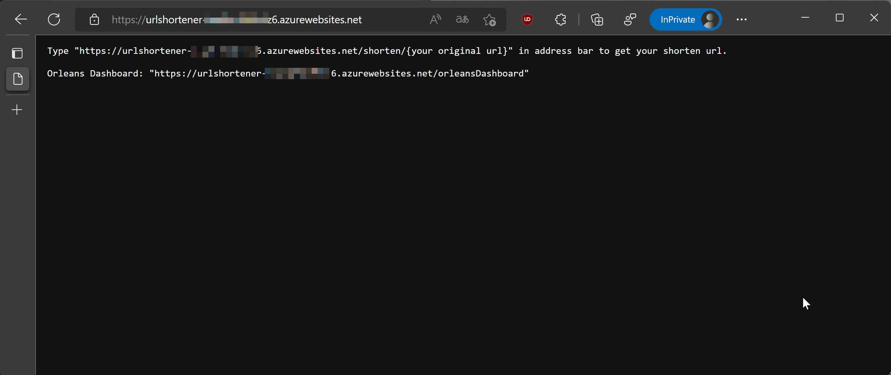
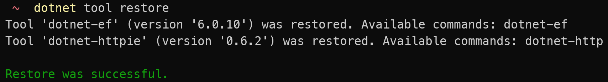
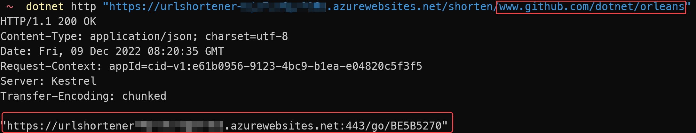
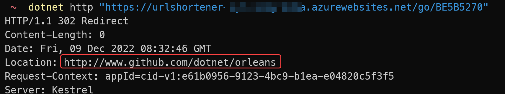

# OrleansUrlShortener

Microsoft Orleans example project on [Microsoft Learn course](https://docs.microsoft.com/en-us/learn/modules/orleans-build-your-first-app/) demonstrates [Smart Cache Pattern](https://github.com/OrleansContrib/DesignPatterns/blob/master/Smart%20Cache.md)

Add some other error prevention, add Orleans Dashboard and successful deploy to Azure WebApp.



You can use dotnet-httpie tool to test the UrlShortener API:

1. Inside this project folder, type `dotnet tool restore` to install/restore the [dotnet-httpie](https://github.com/WeihanLi/dotnet-httpie) tool.
    
2. Invoke following command to create a shorten URL entry:
    ```sh
    dotnet http "[the_deployed_root_url]/shorten/[your_url]"
    ```
    replace the [the_deployed_root_url] with your deployed Azure service root url, and the [your_url] is the web page url address you want to shorten, like the following running example screenshot, we shorten the *www.github.com/dotnet/orleans* url:
      
    Remember to keep the Last 8 Hexadecimal characters of the response, that is the shorten Url code that we will use it in the next step.
3. Invoke following command once you have create a shorten Url code in previous step:
    ```sh
    dotnet http "[the_deployed_root_url]/go/[shorten_url_code]"
    ```
    replace the [the_deployed_root_url] with your deployed Azure service root url, the [shorten_url_code] is the shorten Url code you get in the previous step, it will has the HTTP 302 response like following screenshot:
      
    Actually you can use that URL directly in your Internet Browser, it will redirect to Microsoft Orleans' GitHub home page(*www.github.com/dotnet/orleans*).


